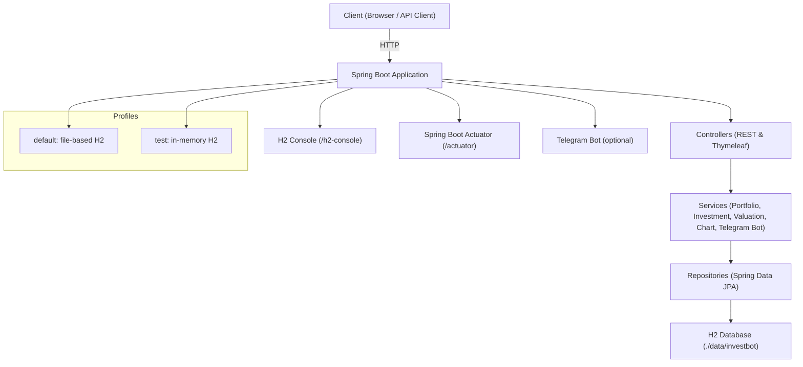

# Demo (Spring Boot)

A simple investment portfolio demo with REST endpoints, a basic UI, and H2 persistence.

## Quick start

```bash
# Prereqs: Java 21, Gradle wrapper
cd /Users/setayande/Documents/demo
./gradlew bootRun
```

- App: http://localhost:8080/
- H2 Console: http://localhost:8080/h2-console (JDBC URL: `jdbc:h2:file:./data/investbot`, user: `sa`, no password)
- Actuator: http://localhost:8080/actuator

## Persistence

- Default profile uses H2 file-based database so data survives restarts:
  - `spring.datasource.url=jdbc:h2:file:./data/investbot`
- Tests use in-memory H2 via `test` profile and do not persist.

## Profiles

- default: file-backed H2
- test: in-memory H2

Run tests:

```bash
./gradlew test
```

## API

Base path: `/api`

- POST `/api/investments`

  - Body:
    ```json
    {
      "userId": 1,
      "type": "COIN",
      "amount": 2.5,
      "currency": "IRR",
      "price": 45000000,
      "operationType": "BUY",
      "date": "2025-01-01T10:00:00Z"
    }
    ```
  - 201 Created on success
  - Notes:
    - `price` is the TOTAL cost you paid for this transaction in the selected `currency` (not unit price).
  - Example:
    ```bash
    curl -X POST http://localhost:8080/api/investments \
      -H 'Content-Type: application/json' \
      -d '{
        "userId":1,
        "type":"COIN",
        "amount":2,
        "currency":"IRR",
        "price":45000000,
        "operationType":"BUY",
        "date":"2025-01-01T10:00:00Z"
      }'
    ```

- GET `/api/investments/{userId}` → list user investments
  ```bash
  curl http://localhost:8080/api/investments/1
  ```
- GET `/api/portfolio/{userId}` → asset balances map
  ```bash
  curl http://localhost:8080/api/portfolio/1
  ```
- GET `/api/portfolio/{userId}/valuation` → valuation summary
  ```bash
  curl http://localhost:8080/api/portfolio/1/valuation
  ```
- GET `/api/portfolio/{userId}/chart` → PNG pie chart

  ```bash
  curl -o chart.png http://localhost:8080/api/portfolio/1/chart
  ```

- GET `/api/investments/{userId}/page` → paginated investments

  - Query params: `page` (default 0), `size` (default 10)

  ```bash
  curl "http://localhost:8080/api/investments/1/page?page=0&size=10"
  ```

- GET `/api/portfolio/{userId}/values` → current asset values in Toman

  ```bash
  curl http://localhost:8080/api/portfolio/1/values
  ```

- GET `/api/portfolio/{userId}/pnl?start=ISO&end=ISO` → P&L per asset (Toman)

  - Dates must be ISO-8601 instants, e.g. `2025-01-01T00:00:00Z`

  ```bash
  curl "http://localhost:8080/api/portfolio/1/pnl?start=2025-01-01T00:00:00Z&end=2025-02-01T00:00:00Z"
  ```

- GET `/api/portfolio/{userId}/allocation` → allocation percent per asset (0-100)
  ```bash
  curl http://localhost:8080/api/portfolio/1/allocation
  ```

## Web UI

- `GET /` renders `templates/index.html` (Thymeleaf). Optional `?userId=1`.

- Features:
  - Record BUY/SELL transactions with date picker and localized number inputs
  - Portfolio table with amounts and current values (in Toman)
  - Downloadable/refreshable pie chart
  - Valuation summary (initial/current/ROI)
  - Paginated investments table (Prev/Next)
  - P&L by date range per asset

## Architecture



## Configuration

See `src/main/resources/application.properties`. Notable keys:

- `spring.h2.console.enabled=true`
- `spring.datasource.url=jdbc:h2:file:./data/investbot`
- `spring.jpa.hibernate.ddl-auto=update`

Pricing (all amounts in TOMAN):

- FX seed rates:
  - `pricing.fx.usd_to_toman=95000`
  - `pricing.fx.eur_to_toman=65000`
- Asset seed prices:
  - `pricing.asset.coin=45000000`
  - `pricing.asset.half_coin=23000000`
  - `pricing.asset.quarter_coin=13000000`
  - `pricing.asset.crypto_btc_toman=4000000000`
- Live pricing:
  - `pricing.live.enabled=true`
  - `pricing.live.source=https://alanchand.com/en`

## Telegram bot (optional)

Disabled by default. Configure in `application.properties`:

- `telegram.bot.enabled=false`
- `telegram.bot.username=`
- `telegram.bot.token=`

Commands (when enabled):

- `/buy <ASSET> <AMOUNT> <CURRENCY> <PRICE>`
- `/sell <ASSET> <AMOUNT> <CURRENCY> <PRICE>`
- `/portfolio` — shows balances and sends a pie chart

Notes:

- Your Telegram `chatId` is used as `userId` in the system.

## Build

```bash
./gradlew clean build
```

Outputs in `build/`.
